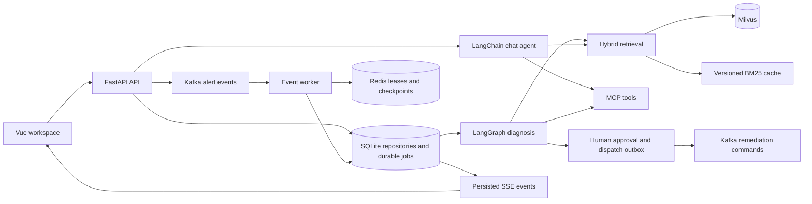

# Agent Py

A personal engineering project for investigating alerts with tool-backed evidence, retrieving runbooks, and reviewing remediation proposals. Built with **Python, FastAPI, Vue 3, LangGraph, Kafka, Redis, SQLite, and Milvus**.

The backend coordinates persistent work, enforces user ownership, and streams progress to the browser. It uses actual configured MCP tools and model providers for diagnosis. The current UI is Chinese; repository documentation is English.

## Features

- **Authentication and ownership:** Argon2 password hashes, hashed bearer tokens, logout revocation, and user-scoped repositories and vector queries.
- **Streaming chat:** persistent conversations, LangChain agents, knowledge/MCP tools, configurable prompts, progressively loaded skills, and session memory.
- **Hybrid retrieval:** Markdown/PDF ingestion, durable indexing, Milvus vector recall, BM25L lexical recall, reciprocal rank fusion, and reranking with traceable citations.
- **Incident diagnosis:** a LangGraph Plan-Execute-Replan workflow, active Prometheus/Alertmanager alerts, evidence-linked reports, and persisted SSE events that survive browser disconnection.
- **Reliable event delivery:** manually committed Kafka offsets, retries before advancing to another record, Redis lease ownership checks, and sanitized dead letters.
- **Remediation approval:** an approval and dispatch job committed in one SQLite transaction, atomic dispatch leases, restart recovery, and a stable `commandId` for downstream deduplication.
- **Release and verification:** API/worker ECS revision checks and rollback tooling, real Kafka/Redis integration tests, Playwright browser tests, and public-only frontend configuration.

## Architecture



See [Architecture](docs/architecture.md) and [Engineering decisions](docs/engineering-quality.md) for failure semantics, caching, and storage boundaries.

## Local development

Requirements: **Python 3.10+**, **uv**, **Node.js 22+**, **Docker Compose**, access to the configured Qwen-compatible model service, and Tencent CLS credentials when using the CLS integration.

From the repository root:

```bash
npm ci
cp config/project.template.json config/project.json
cp config/user.project.template.json config/user.project.json
```

Edit the two local JSON files before starting. Set the model API key, chat/embedding model names, model capability profile, and required CLS fields. `config/user.project.json` overrides the base configuration. Both files are Git-ignored; checked-in templates contain empty credential values.

```bash
./scripts/start-local.sh
```

Windows Command Prompt:

```bat
copy config\project.template.json config\project.json
copy config\user.project.template.json config\user.project.json
scripts\start-local.bat
```

The launcher starts the CLS MCP Server, FastAPI, event worker, and frontend. Docker Compose provides Kafka, Redis, etcd, MinIO, Milvus, Attu, and Alertmanager. It also applies Alembic migrations. Use [Getting started](docs/getting-started.md) for manual startup and [Configuration](docs/configuration.md) for field requirements.

| Service | Local address |
| --- | --- |
| Frontend | `http://127.0.0.1:5173` |
| API / OpenAPI | `http://127.0.0.1:8000` / `http://127.0.0.1:8000/docs` |
| CLS MCP SSE | `http://127.0.0.1:3000/sse` |
| Kafka / Redis | `127.0.0.1:9092` / `127.0.0.1:6379` |
| Milvus / Attu | `127.0.0.1:19530` / `http://127.0.0.1:8001` |
| Alertmanager | `http://127.0.0.1:9093` |

## Verification

```bash
cd apps/backend
uv sync --frozen
uv run ruff check .
uv run pyright
uv run pytest
cd ../..
npm run contracts:typecheck
npm --workspace packages/api-contracts test
npm run frontend:typecheck
npm run frontend:test
npm run frontend:build
python3 scripts/check_frontend_bundle.py
npm audit --audit-level=moderate
npm run docs:build
```

Browser tests and real transport checks have explicit setup commands in [Testing](docs/testing.md). CI defines jobs for backend checks, web checks, browsers, real event transport, and container builds. The AWS deployment workflow is manually triggered.

Local verification on **2026-10-04** passed **185 backend tests, 82 frontend tests, 24 contract tests, 3 real Kafka/Redis tests, and 3 Chromium browser tests**, plus static checks and both Docker builds. These are local results; they do not assert that a GitHub-hosted run or an AWS deployment has completed.

## Retrieval benchmark

A fixed-seed BM25 microbenchmark compared rebuilding an index for each query with reusing it:

| Chunks | Rebuild P95 | Reused index P95 | Rankings and scores |
| --- | --- | --- | --- |
| 1,000 | 6.83 ms | 0.91 ms | Identical |
| 10,000 | 104.23 ms | 44.32 ms | Identical |
| 100,000 | 1160.79 ms | 283.43 ms | Identical |

At 100,000 chunks, measured P95 fell by approximately **75.6%**. This measures only lexical index construction and ranking; it excludes database scans, Milvus, embeddings, reranking, network traffic, and concurrent API load. See [Benchmark methodology and raw results](docs/benchmarks/README.md).

## Project layout

```text
apps/backend/           FastAPI, agents, repositories, migrations, workers, and tests
apps/frontend/          Vue workspace, typed clients, and browser tests
packages/api-contracts/ Shared HTTP, error, OpenAPI, and SSE contracts
config/                 Public templates; private local JSON is ignored
infra/                  Local infrastructure Compose stack
deploy/aws/             ECS deployment reference
evaluations/            Versioned synthetic incident inputs and runner instructions
docs/                   Architecture, configuration, operations, testing, and benchmarks
scripts/                Launchers and release checks
```

## Deployment and scope

SQLite targets a **local, single-node workspace**. Production replication requires a database adapter and transport security configuration. The current repository does not include a production remediation executor. Command delivery is **at least once**: an external executor must deduplicate `commandId` before applying side effects.

The evaluation runner executes against an explicitly selected API and records actual predictions and latency. Model token usage, cost, citation correctness, and MTTR remain unmeasured unless independently captured or annotated. The dataset contains synthetic scenario variants, rather than production incident evidence.

- [AWS deployment](deploy/aws/README.md)
- [Evaluation](evaluations/README.md)
- [Operations and monitoring](docs/operations-and-monitoring.md)
- [Real integration fixtures](docs/tutorials/real-log-and-alert.md)
- [Contributing](CONTRIBUTING.md)
