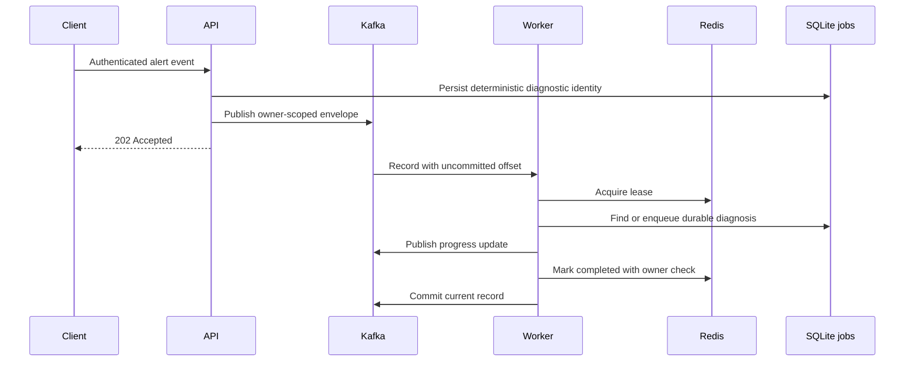

# Architecture

Agent Py separates HTTP and streaming transport, agent orchestration, persistent repositories, and external integrations. Request schemas and the authentication router live outside the application factory; the factory assembles resources and registers durable job handlers.

## Components

| Component | Responsibility |
| --- | --- |
| Vue 3 / Pinia / typed clients | Authentication, chat, document workflows, diagnosis, and MCP management |
| FastAPI | Success/error envelopes, authenticated ownership, uploads, and SSE |
| LangChain chat agent | On-demand knowledge and enabled MCP tools, prompts, skills, and memory |
| LangGraph diagnosis | Planner, executor, replanner, reports, and evidence persistence |
| SQLite / SQLAlchemy / Alembic | Users, sessions, documents, jobs, audit records, approvals, and migrations |
| Milvus | User/tenant-scoped vector chunks and vector recall |
| Kafka | Alert events, progress updates, dead letters, and remediation commands |
| Redis | Event processing leases, completed markers, and workflow checkpoints |
| Qwen-compatible provider / CLS MCP | Configured model calls, embeddings, reranking, and actual log tools |

External clients are initialized lazily or through explicit runtime paths. Importing modules must not establish external connections.

## Document and retrieval path

1. An authenticated upload validates Markdown/PDF input, records its hash and metadata, and enqueues an indexing job.
2. The job extracts text, applies the selected chunking strategy, embeds chunks, and inserts scoped vectors.
3. Retrieval runs vector and lexical recall in parallel, filters by owner and requested scope, fuses ranks with RRF (`k=60`), and reranks candidates.
4. Results retain vector/BM25/RRF/rerank fields and source metadata. No matching evidence produces an empty result.

The shared BM25 cache keys include owner, knowledge bases, document filters, metadata filters, and a database document revision. Builds check the revision before and after loading. The cache has a 60-second TTL, a 32-entry LRU limit, and a 32-million-character text budget. See [Engineering decisions](engineering-quality.md).

## Event and durable execution path

A busy lease is a retryable failure, while a completed marker is a duplicate. The worker retries processing and commit on the same record before polling another. Default exhaustion after three attempts exits with the offset uncommitted. Invalid envelopes enter a sanitized dead-letter topic; broker failure publishing that dead letter also prevents commit.

Durable jobs record attempts, leases, heartbeats, timeout, cancellation, and terminal status. Persisted job events allow SSE clients to reconnect after a browser disconnect. Both API and event-worker application lifespans start this runtime; separating the two processes does not create separate databases or separate job queues.

## Approval and dispatch

Approving a pending request atomically commits the decision and one deterministic dispatch job. A database lease gives one sender the right to publish and finalize dispatch state; stale lease tokens cannot update a newer claim. The existing runtime recovers unsent approved work after restart.

Kafka and SQLite do not share a transaction. A process can exit after broker acknowledgement and before persisting success, causing redelivery. Every command includes a stable `commandId`; the external executor must enforce deduplication before side effects. The repository provides approval and delivery, not a production command executor.

## Permission and configuration boundaries

Authenticated server context determines ownership. Client-submitted owner/tenant identifiers do not grant access. Repositories and vector operations preserve user, tenant, knowledge-base, and document scopes.

Application configuration comes from local JSON with user overrides. A Vite build plugin emits only the public API URL into the browser. Full private JSON, cloud credentials, and model API keys remain outside frontend assets.

## Production boundary

The implemented database is SQLite and the Compose transport is local plaintext Kafka/Redis. Multi-replica operation needs a production database adapter, secure broker connections, operational sizing, and SSE-aware load-balancer configuration. [AWS deployment](deployment.md) describes release tooling and remaining prerequisites.
